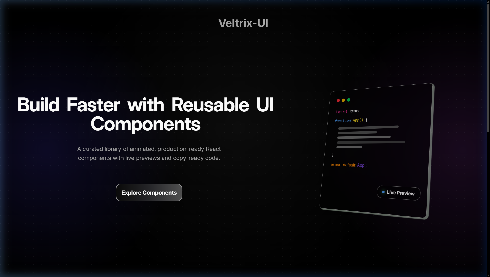
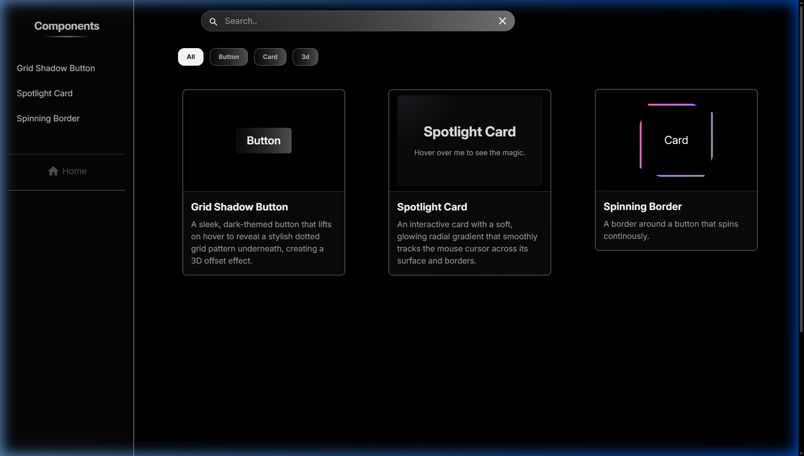
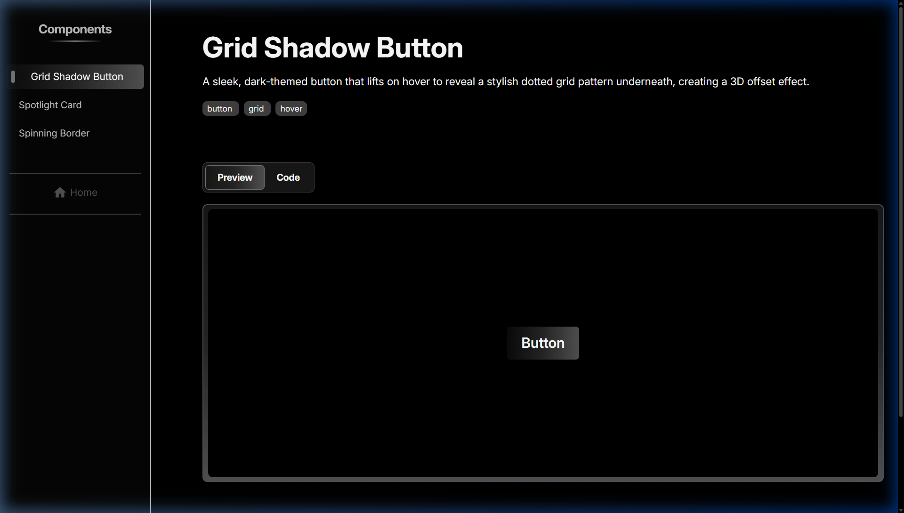
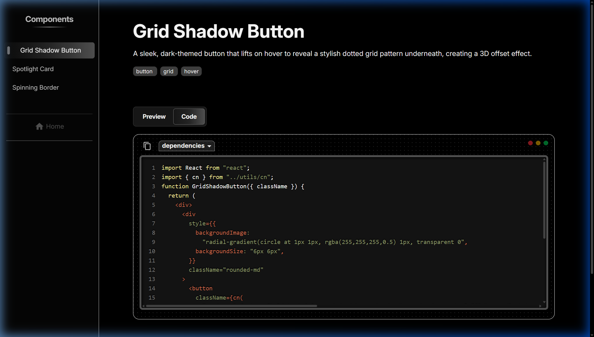

<div align="center">

<br/>

# ⚡ Veltrix UI

### *Build Faster. Ship Smarter.*

**A curated library of animated, production-ready React components**  
**with live previews and copy-ready code.**

<br/>

[](https://react.dev)
[](https://vitejs.dev)
[](https://tailwindcss.com)
[](https://gsap.com)
[](https://www.framer.com/motion/)

<br/>


</div>

---

## 🖼 Screenshots

<table>
  <tr>
    <td align="center"><b>🏠 Hero</b></td>
    <td align="center"><b>🧩 Component Gallery</b></td>
  </tr>
  <tr>
    <td></td>
    <td></td>
  </tr>
  <tr>
    <td align="center"><b>👁 Live Preview</b></td>
    <td align="center"><b>💻 Code View</b></td>
  </tr>
  <tr>
    <td></td>
    <td></td>
  </tr>
</table>

---

## ✨ Features

Veltrix UI is designed for developers who want to move fast without compromising on quality or aesthetics.

| Feature | Description |
|---|---|
| ⚡ **Live Preview** | Interact with every component in real-time before using it |
| 📋 **Copy-Ready Code** | One-click copy of production-ready component source code |
| 🔍 **Instant Search** | Filter components by name, description, or tag instantly |
| 🏷️ **Tag Filtering** | Quickly navigate by category — `button`, `card`, `3d`, and more |
| 🎨 **GSAP Animations** | Buttery-smooth scroll-triggered and entrance animations throughout |
| 📐 **3D Code Block Hero** | A perspective-tilted, animated code window in the hero section |
| 🎭 **Framer Motion Transitions** | Page-to-page transitions with fluid enter/exit animations |
| 🔆 **Syntax Highlighting** | Beautifully formatted code powered by `react-syntax-highlighter` |
| 📱 **Fully Responsive** | Adaptive sidebar + mobile drawer for all screen sizes |
| 🌑 **Dark First Design** | Deep black background with radial gradients and dot-grid textures |

---

## 🧩 Component Library

> Each component ships with a **live interactive preview**, **source code**, and a **dependencies breakdown**.

### Grid Shadow Button
> A sleek, dark-themed button that lifts on hover to reveal a stylish dotted grid pattern underneath, creating a 3D offset shadow effect.
> `tags:` `button` `grid` `hover`

### Spotlight Card
> An interactive card with a soft, glowing radial gradient that smoothly tracks the mouse cursor across its surface and borders — creating a magical spotlight effect.
> `tags:` `card` `interactive` `hover`

### Spinning Border
> An eye-catching animated gradient border that continuously rotates around a card or button, adding motion-rich visual flair with zero effort.
> `tags:` `border` `button` `animation`

---

## 🛠 Tech Stack

| Layer | Technology |
|---|---|
| **Framework** | [React 19](https://react.dev) |
| **Build Tool** | [Vite 7](https://vitejs.dev) |
| **Styling** | [Tailwind CSS v4](https://tailwindcss.com) |
| **Animation** | [GSAP 3](https://gsap.com) + [Framer Motion 12](https://www.framer.com/motion/) |
| **UI Components** | [MUI (Material UI)](https://mui.com) |
| **Icons** | [MUI Icons](https://mui.com/material-ui/material-icons/) |
| **Code Display** | [react-syntax-highlighter](https://github.com/react-syntax-highlighter/react-syntax-highlighter) |
| **Routing** | [React Router v7](https://reactrouter.com) |
| **Error Handling** | [react-error-boundary](https://github.com/bvaughn/react-error-boundary) |
| **Notifications** | [Sonner](https://sonner.emilkowal.ski/) |
| **CSS Utilities** | [clsx](https://github.com/lukeed/clsx) + [tailwind-merge](https://github.com/dcastil/tailwind-merge) |

---

## 📦 Getting Started

### Prerequisites

- **Node.js** v16 or higher
- **npm** or **yarn**

### Installation

1. **Clone the repository**

   ```bash
   git clone https://github.com/yourusername/veltrix-ui.git
   cd veltrix-ui
   ```

2. **Install dependencies**

   ```bash
   npm install
   ```

3. **Start the development server**

   ```bash
   npm run dev
   ```

4. **Open in browser**

   Navigate to [http://localhost:5173](http://localhost:5173) 🎉

### Other Scripts

| Command | Description |
|---|---|
| `npm run dev` | Start development server |
| `npm run build` | Build for production |
| `npm run preview` | Preview production build |
| `npm run lint` | Run ESLint |

---

## 📂 Project Structure

```
veltrix-ui/
├── public/                   # Static assets
├── src/
│   ├── components/           # Reusable layout & UI components
│   │   ├── CardComponent.jsx     # Component preview card
│   │   ├── Sidebar.jsx           # Desktop sidebar navigation
│   │   ├── MobileSideBar.jsx     # Mobile drawer navigation
│   │   ├── Footer.jsx            # App footer
│   │   └── DependenciesDropdown.jsx  # Per-component dependency list
│   │
│   ├── pages/                # Route-level page components
│   │   ├── HomePage.jsx          # Landing page with hero & featured grid
│   │   ├── ComponentsPage.jsx    # Searchable & filterable gallery
│   │   ├── ComponentDetailPage.jsx  # Preview + Code tab view
│   │   └── NotFound.jsx          # 404 page
│   │
│   ├── ui/                   # Raw component source files (used as code strings)
│   │   ├── GridShadowButton.jsx
│   │   ├── SpotlightCard.jsx
│   │   └── SpinningBorder.jsx
│   │
│   ├── data/                 # Component metadata & registry
│   │   ├── Components.js         # Component list with slugs, tags, code imports
│   │   └── PreviewRegistry.js    # Slug → live preview component map
│   │
│   ├── utils/                # Utility functions (cn, etc.)
│   ├── App.jsx               # Root component with routing
│   └── main.jsx              # Entry point
│
├── package.json
├── vite.config.js
└── ...
```

---

## 🤝 Contributing

Contributions are very welcome! Whether it's a new component, a bug fix, or a design improvement.

1. **Fork** the repository
2. **Create** your feature branch
   ```bash
   git checkout -b feature/MyAmazingComponent
   ```
3. **Add your component** in `src/ui/` and register it in `src/data/Components.js`
4. **Commit** your changes
   ```bash
   git commit -m "feat: add MyAmazingComponent"
   ```
5. **Push** to your branch
   ```bash
   git push origin feature/MyAmazingComponent
   ```
6. **Open a Pull Request** 🚀

### Component Submission Checklist
- [ ] Component is self-contained and copy-paste ready
- [ ] Includes a clear description and tags
- [ ] Has a live interactive preview registered in `PreviewRegistry.js`
- [ ] Lists any external dependencies in the component metadata

---

## 📄 License

Distributed under the **MIT License**. See [`LICENSE`](./LICENSE) for more information.

---

<div align="center">

**Built with ❤️ for developers who value beautiful UI.**

*Star ⭐ the repo if Veltrix UI saved you time!*

</div>
